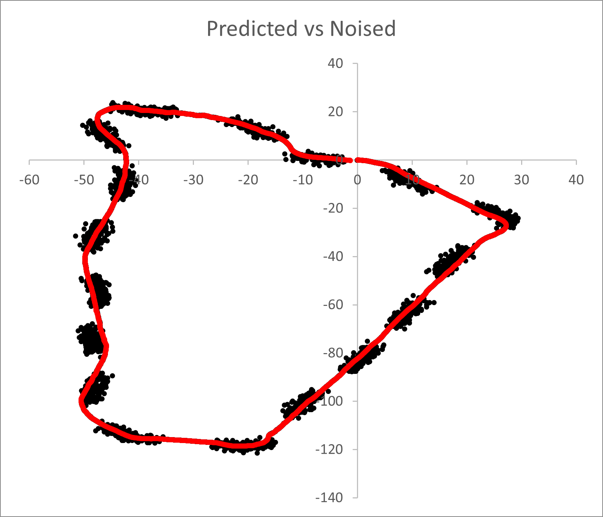

# gnss_ins_fusion

This repository implements nonlinear sequential Bayesian filters with a unified interface.  
The demo program was created with the assumption that GNSS and INS sensor fusion would be used to estimate position.  

## classes
* Extended Kalman Filter (EKF)  
* Unscented Kalman Filter (UKF)  
* Particle Filter (PF)  

They inherit the SequentialBayesianFilter interface.  
The functionality of a simple linear Kalman filter is subsumed in EKF.  

## files

* [sequential_bayesian_filter.h](src/sequential_bayesian_filter.h) ... Header only library which includes EKF, UKF, and PF. This library depends on Eigen.  
* [main.cpp](src/main.cpp) ... Demo program which includes subscription node, dynamics description, intentional noise addition, and logging. The ROS2 environment is required to use the system as is. And sensor_msgs/msg/NavSatFix and sensor_msgs/msg/IMU messages must be published from an external node or process.  

## usage

As described in the main.cpp, each filter has the following usage in common.  
```
auto f = make_shared<ExtendedKalmanFilter>(x0, y_size, u_size);
// initialize 'f->A', 'f->B', 'f->C' if you use a linear model.
// by default, each matrix is initialized with an identity matrix.
// initialize 'f->transition_func', 'f->observation_func' if you use a nonlinear model.

// loop
{
  // -- predict step --
  // update 'f->dt'.
  // update 'f->Q' if needed.
  // update 'f->A' as the Jacobian matrix if you use EKF.
  auto predicted = f->update(u);
  
  // -- update step --
  // update 'f->R' if needed.
  // update 'f->C' as the Jacobian matrix if you use EKF.
  auto corrected = f->update(y);
}
```

## demo

Trajectory predicted sequentially by UKF vs. trajectory with occasional noise of 2.0 m standard deviation and a little bias.  
I conducted it with bag data, but have not uploaded it here. Please prepare your own data for the demo program.  

  

## related works
[Here](https://github.com/husty530/Husty-public) is C# implementation.  

## references
* [Wikipedia - kalman filter](https://en.wikipedia.org/wiki/Kalman_filter)  
* [Wikipedia - particle filter](https://en.wikipedia.org/wiki/Particle_filter)  
